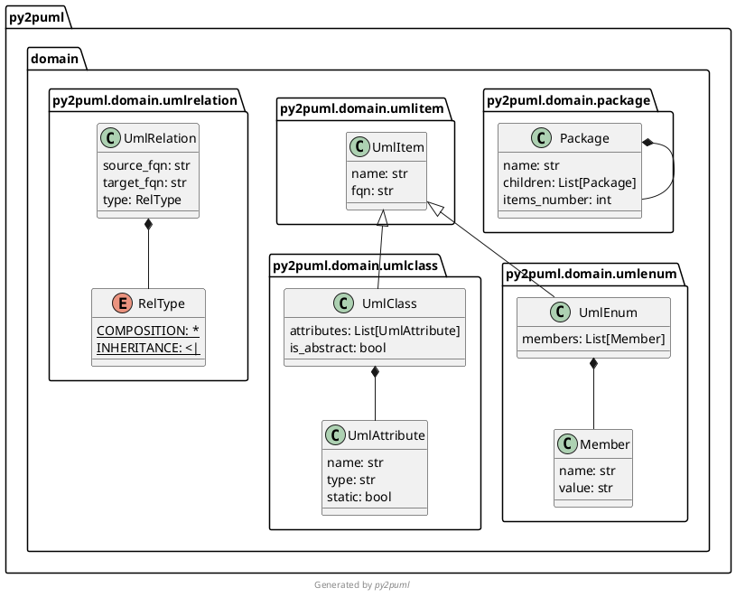

<div align="center">
  <a href="" target="_blank">
    
  </a>
  <h1>Py2puml Testing Suite</h1>
</div>

This Testing Suite is a project designed to thoroughly test the functionality and reliability of the Py2Puml tool, which generates UML diagrams from Python code.


# How it works

This Testing Suite is implemented using popular testing frameworks and libraries in the Python ecosystem, such as:
•	Unittest 
•	Pytest 
•	Hypothesis 
•	Pytest-benchmark 
•	Pynguin 
•	Robot Framework
It leverages assertions, test fixtures, and libraries offered by the above toolset to define and run test cases, enabling automated and systematic testing of Py2Puml's functionality.

## Features

The repository contains the Py2Puml Testing Suite, which includes a comprehensive set of test cases to ensure the accuracy, reliability, and functionality of the Py2Puml tool. The repository's `/tests` directory contains various subdirectories, each focusing on specific features and aspects of Py2Puml. Here's a summary of the main directories and files:

- **`/tests/py2puml`**: This directory serves as the main directory for Py2Puml tests. It contains multiple subdirectories, each representing a specific feature or behavior being tested in Py2Puml. Some of the directories within `/tests/py2puml` include:

  - `basicclass`: Tests the generation of UML class diagrams for simple Python classes.
  - `checkconstructor`: Ensures that Py2Puml correctly handles class constructors and represents them in UML diagrams.
  - `checkdecorator`: Verifies the correct handling of decorators applied to classes and their impact on UML diagrams.
  - `checkdocstring`: Tests the extraction and representation of docstrings within Python classes in the generated UML diagrams.
  - `checkinheritance`: Validates the accurate representation of inheritance relationships between classes.
  - ... (and other directories representing different features)

- **`/tests/asserts`**: Contains test cases to verify the correctness and accuracy of assertions used within the Py2Puml Testing Suite.

- **`/tests/modules`**: Includes test cases to assess the handling and behavior of Python modules within Py2Puml, specifically focusing on how dependencies between modules are extracted and represented in the generated UML diagrams.

- **`/tests/puml_files`**: Contains test cases to ensure the correctness and completeness of the PlantUML files generated by Py2Puml, which represent the Python code and its relationships in UML diagrams.

Additionally, there are various files within the `/tests` directory that provide test utilities and configurations. These files include `conftest.py`, `test__init__.py`, `test__main__.py`, `test_cli.py`, `test_example.py`, `test_modules.py`, `test_py2puml.py`, and `test_utils.py`.

Overall, the Py2Puml Testing Suite employs a range of testing frameworks, libraries, and test cases to thoroughly assess the functionality of Py2Puml and ensure accurate UML diagram generation from Python code.

# Install

Install Pandas from [PyPI](https://pypi.org/project/pandas/):

* with `pip`:

```sh
pip install pandas
```

Install Numpy from [PyPI](https://pypi.org/project/numpy/):

* with `pip`:

```sh
pip install numpy
```

Install PyTest from [PyPI](https://pypi.org/project/pytest/):

* with `pip`:

```sh
pip install pytest
```

Install UnitTest from [PyPI](https://pypi.org/project/unittest/):

* with `pip`:

```sh
pip install unittest
```

Install Pynguin from [PyPI](https://pypi.org/project/pynguin/):

* with `pip`:

```sh
pip install pynguin
```

Install Hypothesis from [PyPI](https://pypi.org/project/hypothesis/):

* with `pip`:

```sh
pip install hypothesis
```

Install RobotFramework from [PyPI](https://pypi.org/project/robotframework/):

* with `pip`:

```sh
pip install robotframework
```

Install Py2puml from [PyPI](https://pypi.org/project/py2puml/):

* with `pip`:

```sh
pip install py2puml
```

Install Coverage from [PyPI](https://coverage.readthedocs.io/en/7.2.5/):

* with `pip`:

```sh
pip install coverage
```

Install Pytest-Benchmark from [PyPI](https://pypi.org/project/pytest-benchmark/):

* with `pip`:

```sh
pip install pytest-benchmark
```

Install Pygal from [PyPI](https://pypi.org/project/pygal/):
* with `pip`:

```sh
pip install pygal
```
# Usage

## CLI

Once `py2puml` is installed at the system level, an eponymous command is available in your environment shell.

For example, to create the diagram of the classes used by `py2puml`, run:

```sh
py2puml py2puml/domain py2puml.domain
```

This outputs the following PlantUML content:



Using PlantUML, this content is rendered as this diagram:


For a full overview of the CLI, run:

```sh
py2puml --help
```

The CLI can also be launched as a python module:

```sh
python -m py2puml py2puml/domain py2puml.domain
```

Pipe the result of the CLI with a PlantUML server for instantaneous documentation (rendered by ImageMagick):

```sh
# runs a local PlantUML server from a docker container:
docker run -d --rm -p 1234:8080 --name plantumlserver plantuml/plantuml-server:jetty

py2puml py2puml/domain py2puml.domain | curl -X POST --data-binary @- http://localhost:1234/svg/ --output - | display

# stops the container when you don't need it anymore, restarts it later
docker stop plantumlserver
docker start plantumlserver
```

## Python API

For example, to create the diagram of the classes used by `py2puml`:

* import the `py2puml` function in your script (see [py2puml/example.py](py2puml/example.py)):

```python
from py2puml.py2puml import py2puml

if __name__ == '__main__':
    # outputs the PlantUML content in the terminal
    print(''.join(py2puml('py2puml/domain', 'py2puml.domain')))

    # writes the PlantUML content in a file
    with open('py2puml/domain.puml', 'w') as puml_file:
        puml_file.writelines(py2puml('py2puml/domain', 'py2puml.domain'))
```

* running it (`python3 -m py2puml.example`) outputs the previous PlantUML diagram in the terminal and writes it in a file.


# Tests

```sh
# directly with poetry
poetry run pytest -v

# in a virtual environment
python3 -m pytest -v
```

Code coverage (with [missed branch statements](https://pytest-cov.readthedocs.io/en/latest/config.html?highlight=--cov-branch)):

```sh
poetry run pytest -v --cov=py2puml --cov-branch --cov-report term-missing --cov-fail-under 92
```

# Changelog

* `0.7.2`: added the current working directory to the import path to make py2puml work in any directory or in native virtual environment (not handled by poetry)
* `0.7.1`: removed obsolete part of documentation: deeply compound types are now well handled (by version `0.7.0`)
* `0.7.0`: improved the generated PlantUML documentation (added the namespace structure of the code base, homogenized type  between inspection and parsing), improved relationships management (handle forward references, deduplicate relationships)
* `0.6.1`: handle class names with digits
* `0.6.0`: handle abstract classes
* `0.5.4`: fixed the packaging so that the contribution guide is included in the published package
* `0.5.3`: handle constructors decorated by wrapping decorators (decorators making uses of `functools.wrap`)
* `0.5.2`: specify in pyproject.toml that py2puml requires python 3.8+ (`ast.get_source_segment` was introduced in 3.8)
* `0.5.1`: prevent from parsing inherited constructors
* `0.5.0`: handle instance attributes in class constructors, add code coverage of unit tests
* `0.4.0`: add a simple CLI
* `0.3.1`: inspect sub-folders recursively
* `0.3.0`: handle classes derived from namedtuples (attribute types are `Any`)
* `0.2.0`: handle inheritance relationships and enums
* `0.1.3`: first release, handle all modules of a folder and compositions of domain classes

# Licence

Unless stated otherwise all works are licensed under the [MIT license](http://spdx.org/licenses/MIT.html), a copy of which is included [here](LICENSE).

# Contributions

* [Luc Sorel-Giffo](https://github.com/lucsorel)
* [Doyou Jung](https://github.com/doyou89)
* [Julien Jerphanion](https://github.com/jjerphan)
* [Luis Fernando Villanueva Pérez](https://github.com/jonykalavera)

Pull-requests are welcome and will be processed on a best-effort basis.
Follow the [contributing guide](CONTRIBUTING.md).

# Current limitations

* regarding **inspection**

  * type hinting is optional when writing Python code and discarded when it is executed, as mentionned in the [typing official documentation](https://docs.python.org/3/library/typing.html). The quality of the diagram output by `py2puml` depends on the reliability with which the type annotations were written

  > The Python runtime does not enforce function and variable type annotations. They can be used by third party tools such as type checkers, IDEs, linters, etc.

* regarding the detection of instance attributes with **AST parsing**:
  * only constructors are visited, attributes assigned in other functions won't be documented
  * attribute types are inferred from type annotations:
    * of the attribute itself
    * of the variable assigned to the attribute: a signature parameter or a locale variable
    * to avoid side-effects, no code is executed nor interpreted

# Alternatives

If `py2puml` does not meet your needs (suggestions and pull-requests are **welcome**), you can have a look at these projects which follow other approaches (AST, linting, modeling):

* [pyreverse](https://pylint.pycqa.org/en/latest/additional_commands/index.html#pyreverse), which includes a PlantUML printer [since version 2.10.0](https://pylint.pycqa.org/en/latest/whatsnew/changelog.html?highlight=plantuml#what-s-new-in-pylint-2-10-0)
* [cb109/pyplantuml](https://github.com/cb109/pyplantuml)
* [deadbok/py-puml-tools](https://github.com/deadbok/py-puml-tools)
* [caballero/genUML](https://github.com/jose-caballero/genUML)
# csit-926-py2puml-testing
